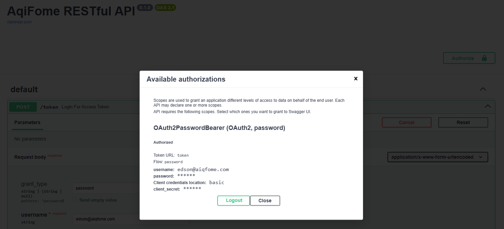

# API RESTfull - AQIFome


## Considerações 

Este projeto foi desenvolvido com foco em boas práticas de desenvolvimento, organização de código e documentação clara. Aplicando SOLID, DDD e princípios de Clean Architecture, a API está preparada para atender às demandas de alta performance e escalabilidade ou troca de framework, caso necessário.

Observou-se a necessidade de autenticação e autorização, implementando um sistema de autenticação JWT para garantir a segurança das operações. A API foi projetada para ser facilmente extensível, permitindo a adição de novas funcionalidades no futuro sem comprometer a estrutura existente.

A escolha do PostgreSQL como banco de dados relacional garante robustez e confiabilidade, enquanto o uso de Docker e Docker Compose facilita a configuração e o deploy do ambiente de desenvolvimento.

Obs.: Pensando em maior escalabilidade conforme requisitos futuros, pode-se considerar a possibilidade de utilizar o Redis para cache de produtos favoritos, melhorando a performance em consultas frequentes ou aplicação de mensageria para processamento assíncrono de tarefas, como consulta de API externa ou atualizações de produtos favoritos.

### [ARD - Arquitetura do Projeto](arquitetura_docs/plan.md)

A API foi desenvolvida utilizando o framework FastAPI, que oferece alta performance e facilidade de uso, além de suporte nativo para documentação automática via Swagger e ReDoc. A estrutura do projeto segue as melhores práticas de organização, com separação clara entre camadas de domínio, serviços, repositórios e APIs externas.

A implementação inclui endpoints para gerenciar clientes e produtos favoritos, com validações rigorosas para garantir a integridade dos dados. A autenticação é realizada através de tokens JWT, garantindo que apenas usuários autenticados possam acessar as funcionalidades da API.


======================

## Contexto

O aiqfome está expandindo seus canais de integração e precisa de uma API robusta para gerenciar os "produtos favoritos" de usuários na plataforma.
Essa funcionalidade será usada por apps e interfaces web para armazenar e consultar produtos marcados como favoritos pelos clientes. A API terá alto volume de uso e integrará com outros sistemas internos e externos.

## 🔧 Desafio:
Desenvolva uma API RESTful que permita: [DESAFIO COMPLETO](DESAFIO.md)

**Clientes**
Criar, visualizar, editar e remover clientes(ADMIN).
Dados obrigatórios: nome e e-mail.
Um mesmo e-mail não pode se repetir no cadastro.

**Favoritos**
Um cliente deve ter uma lista de produtos favoritos.
Os produtos devem ser validados via API externa (link fornecido abaixo).
Um produto não pode ser duplicado na lista de um cliente.
Produtos favoritos devem exibir: ID, título, imagem, preço e review (se houver).
#### 🌐 API Externa
Você pode utilizar especificamente estes dois endpoints:
* Listar todos os produtos:🔗 GET https://fakestoreapi.com/products
* Buscar produto por ID: 🔗 GET https://fakestoreapi.com/products/{id}

### 💡 Requisitos Técnicos Escolhidos
Você pode escolher uma das seguintes linguagens:
    * Python
    * Framework FASTAPI  

### 🗄️ Banco de Dados sugerido:
    * PostgreSQL

### 🛠️ Ferramentas Sugerida execução do projeto localmente
    * Docker
    * Docker Compose

## [Guia de Execução do Ambiente Local (Desenvolvimento)](INSTALL.md)

**Após a inicialização, a aplicação estará disponível no endereço:**

- [ReDoc](http://localhost:8000/redoc) para documentação da API
- [Swagger UI](http://localhost:8000/docs) para documentação da API

### API via Web (localhost:8000/docs)
Para testar a API, você pode usar ferramentas como Postman ou Insomnia, ou até mesmo o Swagger UI integrado na aplicação.

Realize o procedimento para criacao de ADMIN executando o seguinte comando:
```bash
docker exec be_aqifome_restfull-api-1 python api/scripts/seed.py   
```

Resultando na criação de um cliente padrão e popular o banco de dados:
    ** EMAIL=edson@aiqfome.com
    ** PASSWORD=aiQfome123

Obs.: Em seguida você pode acessar a API e realizar as operações de CRUD para clientes e favoritos, iniciando com autenticação com os dados [.env.container](.env.container).




### 📝 Documentação
A documentação da API está disponível no Swagger UI e ReDoc, acessíveis após a inicialização do ambiente local.


### 📦 Estrutura do Projeto

A estrutura do projeto foi cuidadosamente planejada para garantir organização, escalabilidade e facilidade de manutenção, seguindo padrões recomendados para aplicações FASTAPI. Os principais diretórios e arquivos estão descritos abaixo:

```
BE_AqiFome_RESTfull/
├── core/                  # Lógica central da aplicação
│   ├── __init__.py
│   ├── config/            # Configurações e conexão com o banco de dados
│   │   ├── __init__.py
│   │   ├── db.py
│   │   └── settings.py
│   ├── domain/            # Modelos de domínio (entidades e schemas)
│   │   ├── __init__.py
│   │   ├── cliente.py
│   │   ├── favorito.py
│   │   └── produto.py
│   ├── externos/          # Definição de APIs externas
│   │   ├── __init__.py
│   │   └── fake_store_product.py
│   ├── repository/        # Camada de acesso a dados (repositórios)
│   ├── security/          # Autenticação e autorização
│   └── service/           # Regras de negócio e serviços
├── api/
│   ├── main.py            # Ponto de entrada da aplicação FASTAPI
│   └── scripts/
│       ├── __init__.py
│       └── seed.py        # Script para popular dados iniciais (ex: usuário admin)
├── arquitetura_docs/      # Documentação de arquitetura e imagens
├── tests/                 # Testes automatizados
├── requirements.txt       # Dependências do projeto
├── Dockerfile             # Dockerfile para build da aplicação
├── docker-compose.yml     # Orquestração de containers
├── INSTALL.md             # Guia de instalação e execução local
├── .env.container         # Variáveis de ambiente para o container
├── README.md              # Documentação principal do projeto
└── DESAFIO.md              # Desafio proposto
```

**Principais pontos:**
- **core/**: Centraliza a lógica de negócio, modelos, configurações e segurança.
- **api/**: Contém o ponto de entrada da aplicação e scripts utilitários.
- **tests/**: Facilita a manutenção da qualidade do código com testes automatizados.
- **arquitetura_docs/**: Armazena diagramas e imagens de apoio à documentação.
- **Docker e Compose**: Permitem fácil deploy e replicação do ambiente de desenvolvimento.

Essa organização facilita a colaboração, a escalabilidade e a manutenção do projeto ao longo do tempo.
