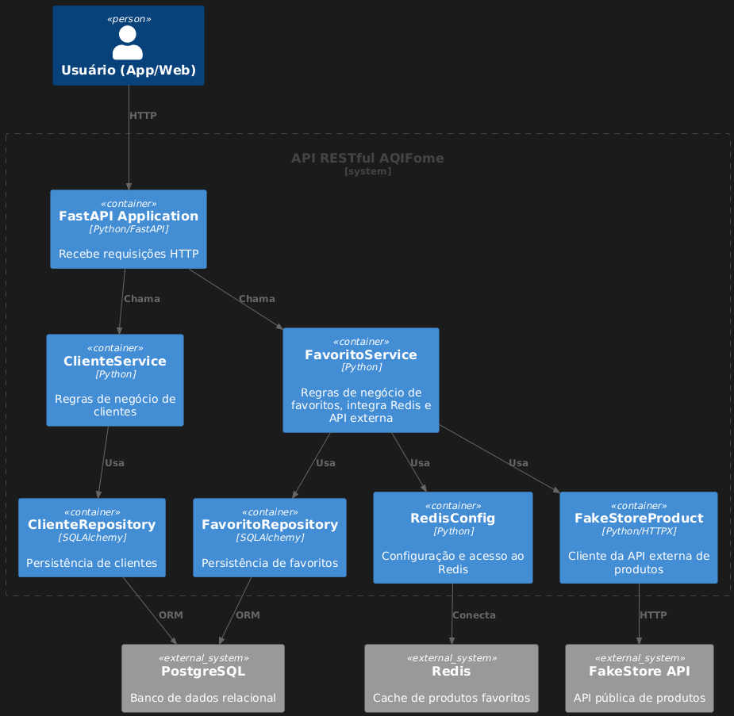
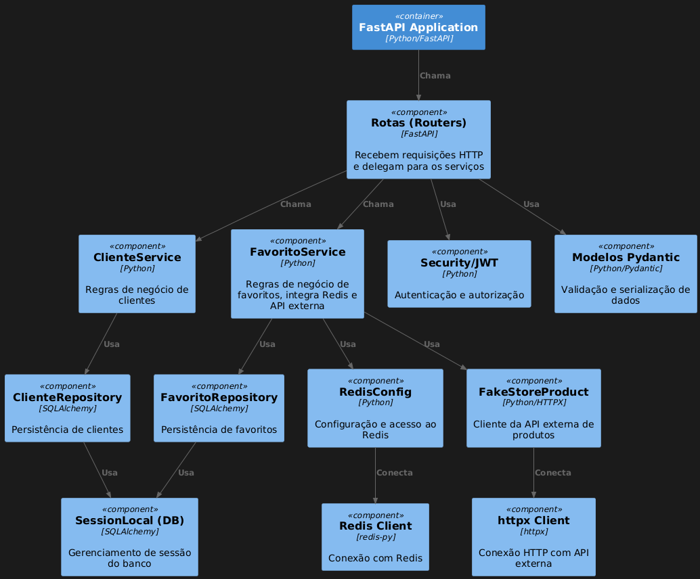

# API RESTfull - AQIFome


## Considerações 

Este projeto foi desenvolvido com foco em boas práticas de desenvolvimento, organização de código e documentação clara. Aplicando SOLID, DDD e princípios de Clean Architecture, a API está preparada para atender às demandas de alta performance e escalabilidade ou troca de framework, caso necessário.

Observou-se a necessidade de autenticação e autorização, implementando um sistema de autenticação JWT para garantir a segurança das operações. A API foi projetada para ser facilmente extensível, permitindo a adição de novas funcionalidades no futuro sem comprometer a estrutura existente.

A escolha do PostgreSQL como banco de dados relacional garante robustez e confiabilidade, enquanto o uso de Docker e Docker Compose facilita a configuração e o deploy do ambiente de desenvolvimento.

Obs.: Pensando em maior escalabilidade conforme requisitos futuros, pode-se considerar a possibilidade de utilizar o Redis para cache de produtos favoritos, melhorando a performance em consultas frequentes ou aplicação de mensageria para processamento assíncrono de tarefas, como consulta de API externa ou atualizações de produtos favoritos.

### [Plano de Tarefas:](arquitetura_docs/plano_tarefas.md)

A API foi desenvolvida utilizando o framework FastAPI, que oferece alta performance e facilidade de uso, além de suporte nativo para documentação automática via Swagger e ReDoc. A estrutura do projeto segue práticas (DDD) aplicando a organização na pasta [CORE](src/core) com separação clara entre camadas de domínio, serviços, repositórios, aplitivo RESTful WEB na [API](src/api) e e servico de APIs Fake em [EXTERNO](src/externos).

A implementação inclui endpoints para gerenciar clientes e favoritos, com validações rigorosas para garantir a integridade dos dados. 
Autenticação é realizada através de tokens JWT, garantindo que apenas usuários autenticados possam acessar as funcionalidades da API.

# API RESTful - AQIFome


======================

## 🔧 [DESCRITO na DESAFIO](DESAFIO.md)

**Clientes**
Criar, visualizar, editar e remover clientes(ADMIN).
Dados obrigatórios: nome e e-mail.
Um mesmo e-mail não pode se repetir no cadastro.

**Favoritos**
Um cliente deve ter uma lista de produtos favoritos.
Os produtos devem ser validados via API externa (link fornecido abaixo).
Um produto não pode ser duplicado na lista de um cliente.
Produtos favoritos devem exibir: ID, título, imagem, preço e review (se houver).

**API Externa**
Utilizado os endpoints de produtos da API => https://fakestoreapi.com/

### 💡 Requisitos Técnicos Escolhidos
Você pode escolher uma das seguintes linguagens:
- Docker
- Docker Compose
- Python
- Framework FASTAPI  
- PostgreSQL
- Redis 

### 🛠️ [Guia de Execução do Ambiente Local (Desenvolvimento)](INSTALL.md)

```bash
git clone https://github.com/edcastanha/BE_AqiFome_RESTfull.git

cd BE_AqiFome_RESTfull/

docker-compose up --build -d
```

**Após a inicialização, a aplicação estará disponível no endereço:**

- [ReDoc](http://localhost:8000/redoc) para documentação da API
- [Swagger UI](http://localhost:8000/docs) para documentação da API

Realize o procedimento para criacao de ADMIN executando o seguinte comando:
```bash
docker exec be_aqifome_restfull-api-1 python helpers/seed.py   
```
Resultando na criação de um cliente padrão e popular o banco de dados:
- **EMAIL**    = edson@aiqfome.com
- **PASSWORD** = aiQfome123

Obs.: Em seguida você pode acessar a API e realizar as operações de CRUD para clientes e favoritos, iniciando com autenticação com os dados [.env.container](./infra/.env.container).


## 📚 Documentação da API

### 📦 Estrutura do Projeto

```
BE_AqiFome_RESTfull/
├── arquitetura_docs/       # Documentação da arquitetura do projeto
│   ├── C4/                 # Diagramas C4 (Contexto, Container, Componentes)
│   ├── plano_tarefas.md    # Plano de tarefas e organização do projeto
│   └── img/                # Imagens de apoio à documentação
├── infra/                 # Infraestrutura do projeto (ex: nginx, .env)
├── src/                  # Código fonte da aplicação
│   ├── core/             # Lógica de negócio, modelos, configurações e segurança
│   ├── api/              # Ponto de entrada da aplicação e scripts utilitários
│   ├── externos/         # Integração com APIs externas (ex: FakeStoreAPI)
│   └── helpers/          # Scripts auxiliares (ex: seed de dados)
│   └── tests/            # Testes automatizados
├── Dockerfile             # Dockerfile para build da aplicação
├── docker-compose.yml     # Orquestração de containers
├── INSTALL.md             # Guia de instalação e execução local
├── README.md              # Documentação principal do projeto
└── DESAFIO.md              # Desafio proposto
```

**Principais pontos:**
- **core/**: Centraliza a lógica de negócio, modelos, configurações e segurança.
- **api/**: Contém o ponto de entrada da aplicação e scripts utilitários.
- **tests/**: Facilita a manutenção da qualidade do código com testes automatizados.
- **arquitetura_docs/**: Armazena diagramas e imagens de apoio à documentação.
- **Docker e Compose**: Permitem fácil deploy e replicação do ambiente de desenvolvimento.

Essa organização facilita a colaboração, a escalabilidade e a manutenção do projeto ao longo do tempo.


### Domínio e Fluxos
- **Cliente**: Entidade persistida no banco relacional (PostgreSQL).
- **Favorito**: Entidade persistida, relaciona Cliente e produto_id (apenas o ID do produto externo).
- **Produto**: Não é entidade local. Os dados são consumidos de API externa e cacheados em Redis.

### Fluxo de Favoritos
- Ao adicionar um favorito:
  1. Valida o produto via API externa (FakeStoreAPI).
  2. Se existir, salva o produto em cache Redis (`produto:{produto_id}`) e registra o favorito (cliente_id, produto_id).

- Ao listar favoritos:
  1. Busca todos os favoritos do cliente (apenas IDs).
  2. Para cada produto_id, busca os dados no Redis. Se não houver, pode buscar na API externa e atualizar o cache.

## 🧩 Design System e Arquitetura do Projeto



Pensando em escalabilidade levei em consideração que poderiamos replicar N pods com a API AiQFome.

Caso necessario, optar por instancias DB (Postgres) Master e Slave, e também considerar o uso de Redis para cache de produtos favoritos, melhorando a performance em consultas frequentes.

Ainda se necessario, podemos aplicar mensageria para processamento assíncrono de tarefas, como consulta de API externa ou atualizações de produtos favoritos.

## Melhorias Futuras

- Implementar OpenTelemetry para monitoramento e rastreamento distribuído.
- Adicionar testes de integração para garantir a qualidade do código.
- Implementar CI/CD para automação de deploy e testes.
