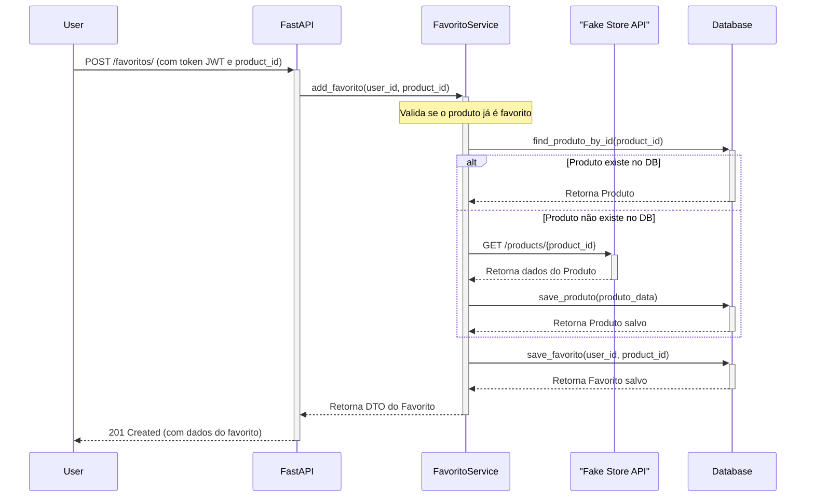

# Diagrama de Sequência: Adicionar Produto Favorito

Este diagrama ilustra o fluxo de adicionar um novo produto à lista de favoritos de um cliente.

```mermaid
sequenceDiagram
    participant User
    participant API as FastAPI
    participant FavoritoService
    participant FakeStoreAPI as "Fake Store API"
    participant Database

    User->>+API: POST /favoritos/ (com token JWT e product_id)
    API->>+FavoritoService: add_favorito(user_id, product_id)
    Note over FavoritoService: Valida se o produto já é favorito
    FavoritoService->>+Database: find_produto_by_id(product_id)
    alt Produto existe no DB
        Database-->>-FavoritoService: Retorna Produto
    else Produto não existe no DB
        FavoritoService->>+FakeStoreAPI: GET /products/{product_id}
        FakeStoreAPI-->>-FavoritoService: Retorna dados do Produto
        FavoritoService->>+Database: save_produto(produto_data)
        Database-->>-FavoritoService: Retorna Produto salvo
    end
    FavoritoService->>+Database: save_favorito(user_id, product_id)
    Database-->>-FavoritoService: Retorna Favorito salvo
    FavoritoService-->>-API: Retorna DTO do Favorito
    API-->>-User: 201 Created (com dados do favorito)
```
